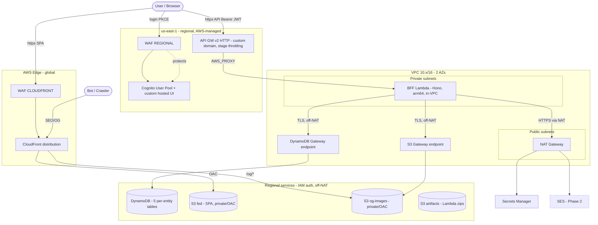
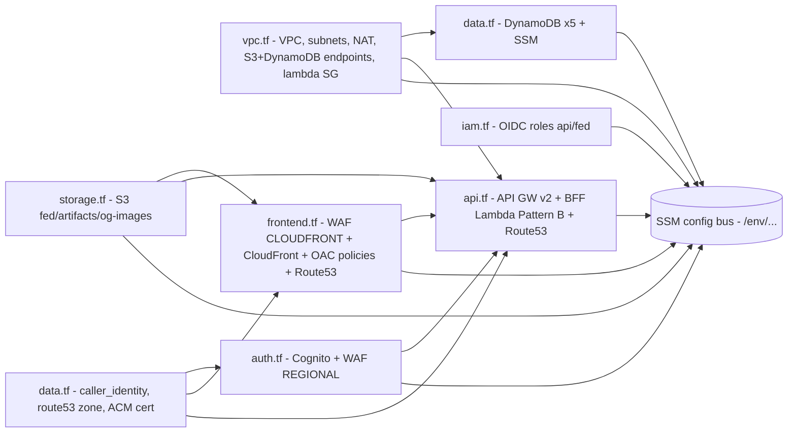

# tadeumendonca-iac — Architecture

Infrastructure for the **tadeumendonca.io** platform, provisioned by a single Terraform root
(`terraform/`), one `.tf` per layer, applied per environment via Terraform Cloud workspaces
(`tadeumendonca-iac-{staging,production}`). Diagrams are Mermaid only (`/workflow/documentation-standard`).

## Runtime network topology

**Key paths.** The SPA loads from S3 via CloudFront + OAC (origin stays private). The API is an HTTP
API on a custom domain fronting only the BFF Lambda; JWT is validated by the API GW Cognito authorizer
(not in the BFF). The BFF runs in private subnets and reaches **DynamoDB and S3 over Gateway endpoints**
(AWS backbone, off the NAT path) and Secrets Manager / SES over **NAT**. WAF: CLOUDFRONT scope on the
distribution, REGIONAL scope on the **Cognito hosted UI only** — an HTTP API can't be WAF-fronted, so it
relies on **stage throttling** instead (`/infrastructure/api-gateway`).

## Terraform module / layer dependency graph

**Cross-layer notes.**
- `api.tf` depends on the lambda SG + private subnets (vpc), the artifacts + og-images buckets (storage),
  the DynamoDB tables (data), and the REGIONAL WAF (auth, for reference). It seeds the API GW with a
  `GET /health` body; the **api repo** owns the full contract (reimport-api, Pattern B for code).
- `auth.tf`'s Cognito **custom domain** requires the frontend host's DNS A record (`frontend.tf`), so
  **frontend is applied before auth**.
- Every layer publishes non-sensitive outputs to the **SSM config bus** (`/{env}/{component}/{name}`);
  the api/fed repos read them at deploy. Secrets (none for the data tier — DynamoDB is IAM-auth) live in
  Secrets Manager.

## Deferred / phased

| Item | Where | Phase |
|---|---|---|
| og-edge Lambda@Edge + CloudFront viewer-request | api.tf (#6b) | 1 |
| SES domain verification + DKIM | auth.tf (#17) | 2 |
| ElastiCache Redis + SNS domain events (BFF env/policy) | cache.tf / sns.tf | 2 |

## Conventions

- One canonical `terraform/` root; per-env differences via `var.environment` conditionals + `env/*.tfvars`.
- Official `terraform-aws-modules/*` first; trusted `cloudposse/*` where no official module exists —
  pinned to **aws-5-compatible** versions (the project pins `aws ~> 5.0`).
- Encryption at rest (AWS-managed KMS keys, no CMK in Phase 1-3) + TLS in transit everywhere.
- checkov hard-fail gate on every PR (`.checkov.yaml` + inline suppressions, curated).
